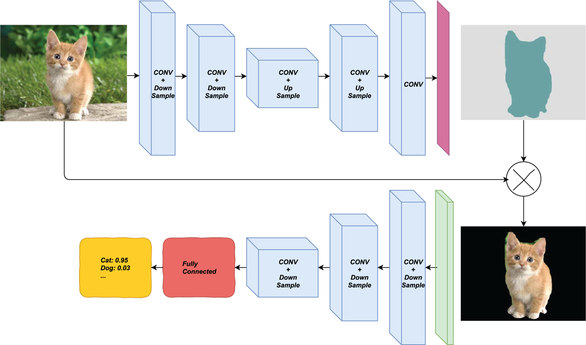
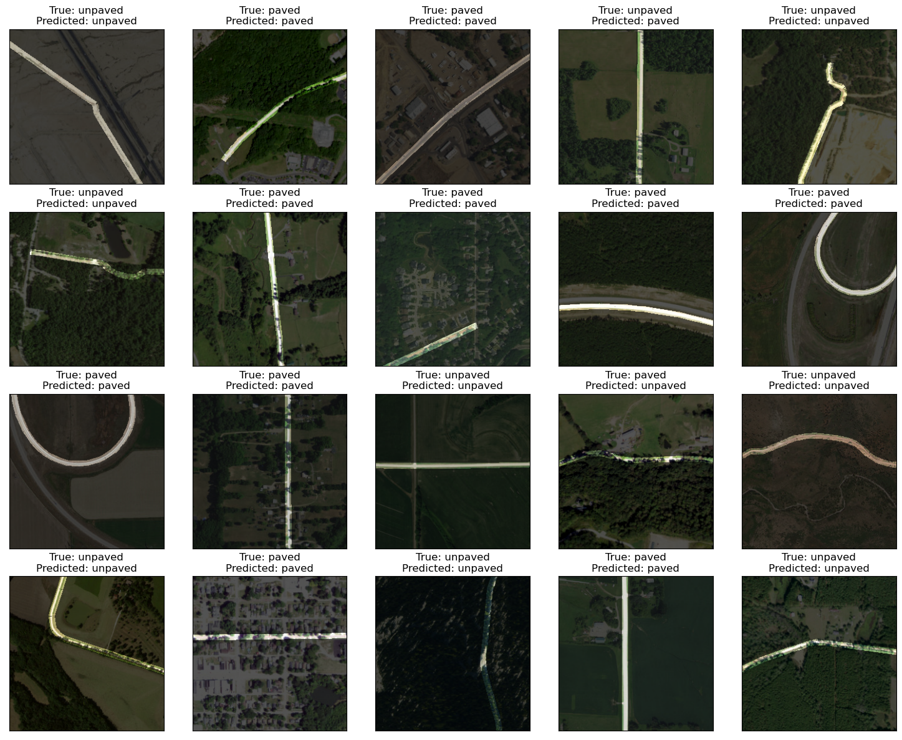
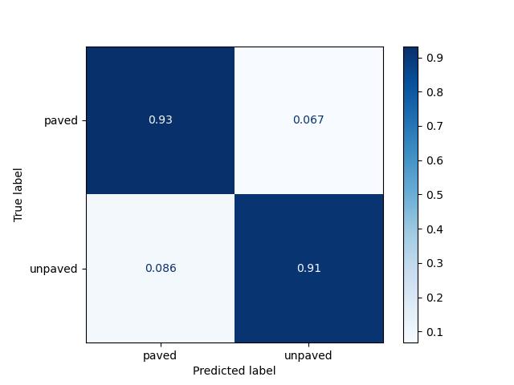
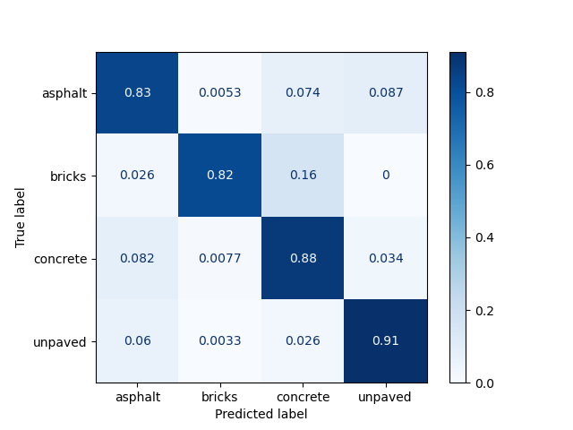

# OpenStreetMap (OSM) Road Surface Classifier

 

This project seeks to leverage machine learning (ML) to aid in the tagging of "drivable ways" (roads) in OpenStreetMap. The main focus at the moment is automating tagging of the road surface type (paved vs. unpaved; but can we go further? asphalt, concrete, gravel, etc.), with other helpful tags such as number of lanes to be added in the future.

> :warning: **Much of this code is under active development. Rapid breaking changes are to be expected.**

## Why Should I Care...

### ... About OpenStreetMap?

It's upsetting that most geospatial data, like that provided in Google Maps, are locked behind ridiculous licensing :no_entry: and paywalls :heavy_dollar_sign:. Maps should not be proprietary. OpenStreetMap aims to change this, [_see more here_](https://wiki.openstreetmap.org/wiki/FAQ#Why_OpenStreetMap?).

### ... About this Project?

Whether a road is paved or unpaved is critical for routing applications to generate useful routes. For example, nominal driving speeds are much slower on unpaved roads vs. paved roads. For bicycles, unpaved routes may need to be avoided completely. In any case, lacking knowledge of road surface type can lead any OSM-based routing application to choose suboptimal routes [if the assumed default surface values are incorrect](https://wiki.openstreetmap.org/wiki/Key:surface#Default_values). Widespread labeling of road surface types can increase overall confidence in OSM-based routers as a viable routing solution for cars :car: and bicycles :bicyclist: alike.

## Integration with OSM

I'm not sure! I have two thoughts:
- I'm currently writing a JOSM plugin that can use this model to add `surface` tags.
- Perhaps this can be used to make automated edits with approval of the OSM community.

## Python Environment
This project has a long set of Python dependencies. My recommendation is to use an [Anaconda](https://www.anaconda.com/) / [Miniconda](https://docs.conda.io/en/latest/miniconda.html) environment for this project:
```console
$ conda create -n rsc_env -c conda-forge --file=requirements.txt
```

Or even, better, I like [mamba](https://mamba.readthedocs.io/en/latest/index.html):
```console
$ mamba create -n rsc_env -c conda-forge --file=requirements.txt
```
Once this is finished, simply run:
```console
$ conda activate rsc_env
```
This will activate the environment with all the necessary Python dependencies.

## Training Dataset
The dataset used in this project was prepared by the process outlined in the [dataset prep notebook](./data_prep.ipynb). It is the aggregation of OpenStreetMap data w/ [National Agriculture Imagery Program (NAIP)](https://basemap.nationalmap.gov/arcgis/rest/services/USGSImageryOnly/MapServer) imagery.

Currently the dataset has been automatically generated, but in some cases has issues related to the visibility of the roads due to vegetation growth. Also of note is that there is no guarantee the labels set in OSM are correct, so we must trust that the vast majority of them are correct. A big source of confusion, for example, is asphalt vs. concrete. It would not surprise me if there are many mislabeled examples of these within OSM.

Contact me if you are interested in the full dataset and maybe I can host it somewhere for access.

> :heavy_exclamation_mark: NAIP imagery is limited to the United States. There are so tiled imagery sources other than NAIP that allow offline processing, and so we are limited to this for now.

<figure>
  
  <figcaption>Examples of NAIP imagery over roads. These are Web Mercator tiles at zoom level 16 (~2.3 meters per pixel). (<i>source: USGS National Agriculture Imagery Program</i>)</figcaption>
</figure>

To support the MaskCNN architecture (_see below_), binary masks were also generated in order to tell the model "where to look":

<figure>
  
  <figcaption>Examples of NAIP imagery over roads with OSM labels (paved vs. unpaved) and generated binary masks from OSM data. (<i>source: USGS National Agriculture Imagery Program [imagery]; OpenStreetMap [labels]</i>)</figcaption>
</figure>

## Machine Learning Model Selection

I'm currently using a MaskCNN model largely based on [Liu et al.: _Masked convolutional neural network for supervised learning problems_](https://par.nsf.gov/servlets/purl/10183705).
  - I'm using a Resnet-19 backbone for both the encoder, decoder, and classifier with great results!
  - By using such a small encoder, performing inference with a CPU remains a quick task!
<figure>
  
  <figcaption>High-level example of MaskCNN architecture. Notice the model first generated a binary mask, which is then multiplied with the source image prior to classification. (<i>source: Liu et al.</i>)</figcaption>
</figure>

The benefit of this model over a plain Resnet is the ability to tell the model what the mask should look like. This tells the classifier "where to look" (i.e. I care about _this_ road in the image, not _that_ one).

The trick is to not force the appearance of this mask too much, because then (1) the model stops looking outside the mask after the multiplication step and (2) the model will care about the mask more than the classification result!

## Model Training

Training is currently done w/ [PyTorch Lightning](https://www.pytorchlightning.ai/), see [`train.py`](./model/train.py).

> :heavy_exclamation_mark: I don't recommend training this model without a dedicated compute GPU configured with CUDA. I know some use [Google Colab](https://colab.research.google.com/), but I'm unfamiliar.

## Model Inference

This is how you can run it yourself! Check out the [model inference notebook](model_inference_example.ipynb).

<figure>
  
  <figcaption>Example inference results using 20 random images in our validation dataset.</figcaption>
</figure>

## Results

**To read the confusion matrix**, for each box, read "when the true label is X, then __% of the time the models predicts Y".

### Paved vs. Unpaved

<figure>
  
  <figcaption>Not bad! The model gets each category right over 90% of the time.</figcaption>
</figure>

### Unpaved vs. Asphalt / Bricks / Concrete

<figure>
  
  <figcaption>Honestly surprising given this is such low resolution imagery (approx. 2.3 meters per pixel). A notable confusion is asphalt vs. concrete and this is not surprising.</figcaption>
</figure>

Overall, this likely rivals what I could do with my eyes, especially with such low resolution imagery. :tada:

## Credits

#### MaskCNN Paper
Liu, L. Y. F., Liu, Y., & Zhu, H. (2020). Masked convolutional neural network for supervised learning problems. Stat, 9(1), e290.

## License
[MIT](https://choosealicense.com/licenses/mit/) &copy; 2022 Jonathan Dalrymple