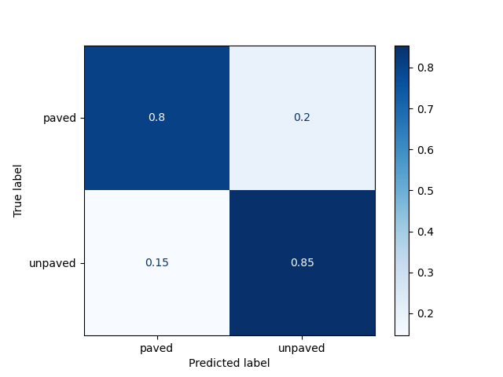

# OpenStreetMap (OSM) Road Surface Classifier

This project seeks to leverage machine learning to aid in the tagging of drivable ways (i.e. roads) in OpenStreetMap. The main focus at the moment is automating tagging of the road surface type (paved vs. unpaved; but can we go further? asphalt, concrete, gravel, etc.), with other helpful tags such as number of lanes to be added in the future.

> :warning: **Much of this code is under active development. Rapid breaking changes are to be expected.**

## Why Should I Care...

### ... About OpenStreetMap?

It's upsetting that most geospatial data, like that provided in Google Maps, are locked behind ridiculous licensing and paywalls. Maps should not be proprietary. OpenStreetMap aims to change this, [see more here](https://wiki.openstreetmap.org/wiki/FAQ#Why_OpenStreetMap?).

### ... About this Project?

Whether a road is paved or unpaved is critical for routing applications to generate useful routes. For example, nominal driving speeds are much slower on unpaved roads vs. paved roads. For bicycles, unpaved routes may need to be avoided completely. In any case, lacking knowledge of road surface type can lead any OSM-based routing application to choose suboptimal routes [if the assumed default surface values are incorrect](https://wiki.openstreetmap.org/wiki/Key:surface#Default_values). Widespread labeling of road surface types can increase overall confidence in OSM-based routers as a viable routing solution for cars and bicycles alike.

## Python Environment
This project has a long set of Python dependencies. My recommendation is to use an [Anaconda](https://www.anaconda.com/) / [Miniconda](https://docs.conda.io/en/latest/miniconda.html) environment for this project:
```console
$ conda create -n rsc_env -c conda-forge --file=requirements.txt
```

Or even, better, I like [mamba](https://mamba.readthedocs.io/en/latest/index.html):
```console
$ mamba create -n rsc_env -c conda-forge --file=requirements.txt
```
Once this is finished, simply run:
```
$ conda activate rsc_env
```
This will activate the environment with all the necessary Python dependencies.

## Dataset
The dataset used in this project was prepared by the process outlined in the [dataset preparation notebook](./data_prep.ipynb). It is the aggregation of OpenStreetMap data w/ [National Agriculture Imagery Program (NAIP)](https://basemap.nationalmap.gov/arcgis/rest/services/USGSImageryOnly/MapServer) imagery.

Currently the dataset has been automatically generated, but in some cases has issues related to the visibility of the roads due to vegetation growth.

Perhaps the full dataset can be hosted somewhere in the future.

## Model Selection

I'm considering a couple model choices:
- Plain Resnet-50 w/ additional binary mask channel
- MaskCNN model mostly based on [this paper](https://par.nsf.gov/servlets/purl/10183705) w/ some modifications for training.
  - Want to test different classifier backbones here, such as Resnet50 (or smaller), VGG-19, etc.

## Model Training

Training is currently done w/ [PyTorch Lightning](https://www.pytorchlightning.ai/).

## Preliminary Results

Currently the best model is based on the MCNN architecture w/ a Resnet50, but it is a little heavyweight and ideally would be slimmed down.

### Best Confusion Matrix


Not so bad! This likely rivals what a human could do, especially given that in many cases roads are hardly visible in the imagery.

## License
[MIT](https://choosealicense.com/licenses/mit/) &copy; 2022 Jonathan Dalrymple