# OpenStreetMap Road Surface Classifier

 

This project leverages machine learning (ML) to aid in the tagging of "drivable ways" (roads) in OpenStreetMap **with > 95% accuracy**. The main focus at the moment is automating tagging of the road surface type (paved vs. unpaved; but skill is shown for asphalt, concrete, gravel, etc.), with other helpful tags such as number of lanes to be added in the future.

> :warning: **Much of this code is under active development. Breaking changes are to be expected.**

## Table of Contents
- [Why Should I Care...](#why-should-i-care)
- [Integration with the OSM Community](#integration-with-the-osm-community)
- [Python Environment](#python-environment)
- [Training Dataset](#training-dataset)
- [Machine Learning Model Selection](#machine-learning-model-selection)
- [Model Training](#model-training)
- [Model Inference](#model-inference)
- [Results](#results)
- [Credits](#credits)

## Why Should I Care...

### ... About OpenStreetMap?

Most geospatial data, like that provided in Google Maps, are locked behind licensing and paywalls. Maps should not be proprietary. OpenStreetMap aims to change this, by providing open geospatial data for everyone. [See more here](https://wiki.openstreetmap.org/wiki/FAQ#Why_OpenStreetMap?).

### ... About this Project?

Road surface type is critical for routing applications to generate useful routes. For example, nominal driving speeds are much slower on unpaved roads vs. paved roads. For bicycles, unpaved routes may need to be avoided completely. In any case, lacking knowledge of road surface type can lead any OSM-based routing application to choose suboptimal routes [if the assumed default surface values are incorrect](https://wiki.openstreetmap.org/wiki/Key:surface#Default_values). Widespread labeling of road surface types can increase overall confidence in OSM-based routers as a viable routing solution for cars :car: and bicycles :bicyclist: alike.

## Integration with the OSM Community

I foresee the following possible integrations with the OpenStreetMap community:
  - Provide a dataset that can augment OSM routing solutions, such as [Project OSRM](https://project-osrm.org/), [Valhalla](https://github.com/valhalla/valhalla), and [cycle.travel](https://cycle.travel/).
  - Integrate the above dataset into editors such as [JOSM](https://josm.openstreetmap.de/) or [Rapid](https://rapideditor.org/). I'm prototyping a plugin for JOSM at the moment.

## Python Environment
I've recently moved from using Anaconda to [pip-tools](https://github.com/jazzband/pip-tools) for my Python projects. The gist for to setup a Python environment for this repo would be:
```bash
$ cd /.../road_surface_classifier          # cd into project directory
$ python3 -m venv ./venv                   # create Python virtual env
$ . venv/bin/activate                      # activate env
(venv) $ python3 -m pip install pip-tools  # install pip-tools
(venv) $ pip-sync                          # automatically installs dependencies!
```
If you wish to change the dependencies for your project, you can modify `requirements.in` and then run the following:
```bash
(venv) $ pip-compile -o requirements.txt requirements.in
(venv) $ pip-sync
```
That's it!

Of note is that this project is (possibly) `pip install`-able given `pyproject.toml`. There's likely no need to `pip install` this project at this time.

## Training Dataset
The dataset used in this project was prepared by the process outlined in [project notebooks](./notebooks). It is the aggregation of OpenStreetMap data w/ [National Agriculture Imagery Program (NAIP)](https://www.usgs.gov/centers/eros/science/usgs-eros-archive-aerial-photography-national-agriculture-imagery-program-naip) imagery, which is public domain. I additionally have a routine that generates pseudo-truth segmentation masks which the model learns to predict.

Currently the dataset has been automatically generated, but in some cases has issues related to the visibility of the roads due to vegetation growth (though the model is trained to predict this). Also of note is that there is no guarantee the labels set in OSM are correct, so we must trust that the vast majority of them are correct. A big source of confusion, for example, is asphalt vs. concrete. It would not surprise me if there are many mislabeled examples of these within OSM.

Contact me if you are interested in the full dataset and maybe I can host it somewhere for access.

> :heavy_exclamation_mark: NAIP imagery is limited to the United States. There are no tiled imagery sources other than NAIP that allow offline processing, and so we are limited to this for now.

<figure>
  
  <figcaption>Examples of NAIP imagery over roads. These are Web Mercator tiles at zoom level 16 (~2.3 meters per pixel). However, the model is trained on raw NAIP data which includes NIR and is 1 meter per pixel. (<i>source: USGS National Agriculture Imagery Program</i>)</figcaption>
</figure>

To support the MaskCNN architecture (_see below_), binary masks were also generated in order to tell the model "where to look":

<figure>
  
  <figcaption>Examples of NAIP imagery over roads with OSM labels (paved vs. unpaved) and generated binary masks from OSM data. (<i>source: USGS National Agriculture Imagery Program [imagery]; OpenStreetMap [labels]</i>)</figcaption>
</figure>

## Machine Learning Model Selection

I'm currently using a MaskCNN model largely based on [Liu et al.: _Masked convolutional neural network for supervised learning problems_](https://par.nsf.gov/servlets/purl/10183705).
  - Instead of multiplication, I concatenate the predicted mask into the classifier backbone.
  - I'm using a Resnet-18 backbone for both the encoder, decoder, and classifier with great results!
  - By using such a small encoder, performing inference with a CPU remains a quick task!
<figure>
  
  <figcaption>Quick diagram of the MaskCNN architecture used here. The NAIP imagery gets combined with a mask created from OSM vector data, which in-turn is used to generate the segmentation mask. All of this is fed into the classifier model.</figcaption>
</figure>

The benefit of this model over a plain Resnet is the ability to tell the model what the mask should look like. This tells the classifier "where to look" (i.e. I care about _this_ road in the image, not _that_ one).

The trick is to not force the appearance of this mask too much, because then (1) the model stops looking outside the mask after the concatenation step and (2) the model will care about the mask more than the classification result!

## Model Training

Training is currently done w/ [PyTorch Lightning](https://www.pytorchlightning.ai/), see [`train.py`](./model/train.py).

> :heavy_exclamation_mark: I don't recommend training this model without a dedicated compute GPU configured with CUDA. I know some use [Google Colab](https://colab.research.google.com/), but I'm unfamiliar.

## Model Inference

At this time I'm only including the code, and not the model... since I'm uncertain on how to license it. Please contact me if you are interested in the actual model.

<details>
<summary>Here are some examples of correct inference for paved roads:</summary>
<br>
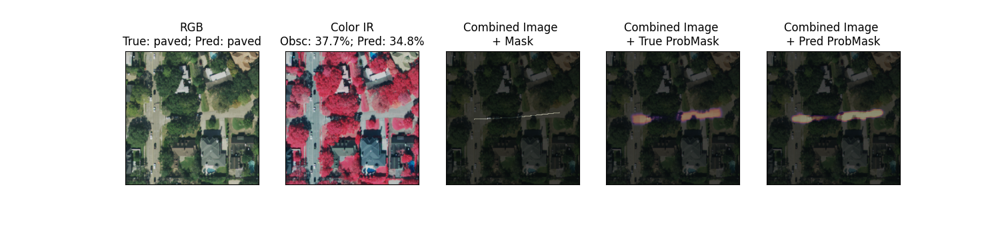
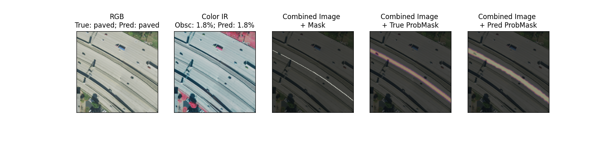
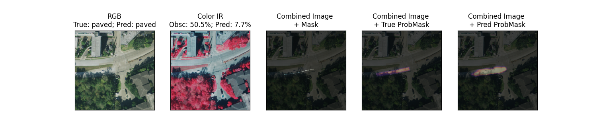
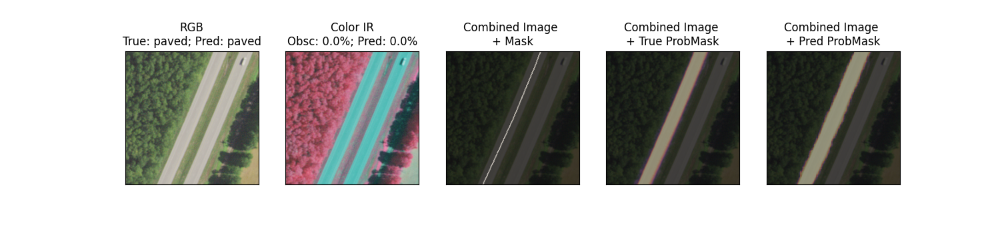
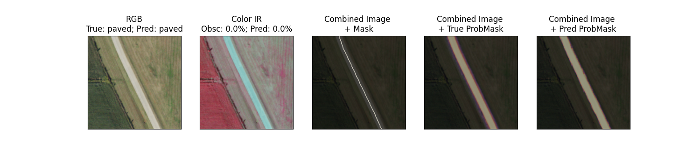
</details>

<details>
<summary>Here are some examples of correct inference for unpaved roads:</summary>
<br>
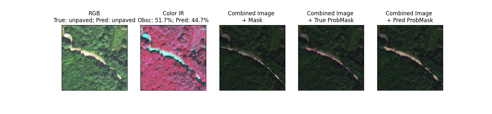
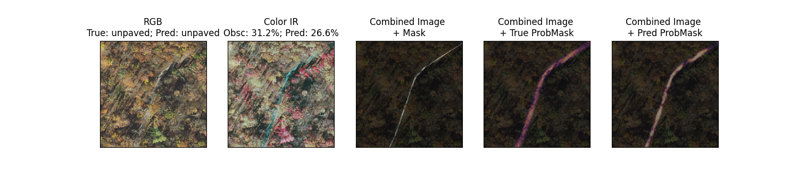
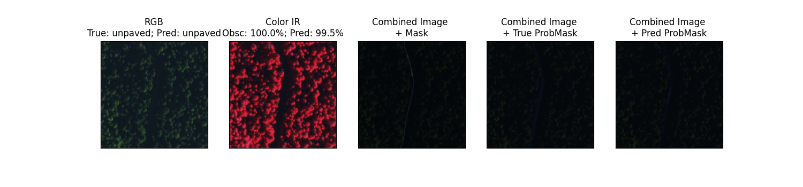
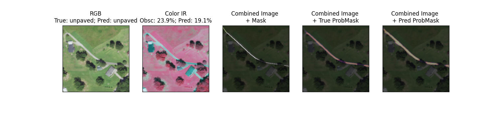
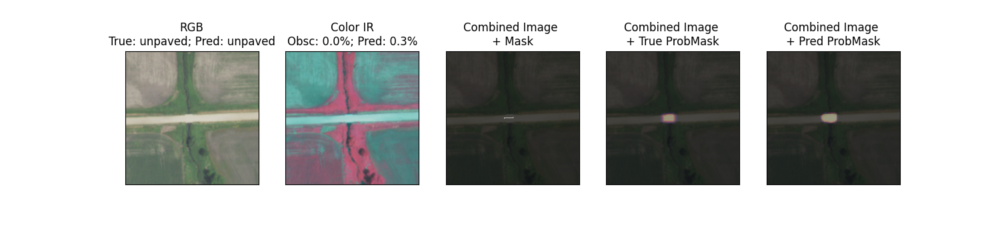
</details>

<details>
<summary>And some examples of incorrect guesses:</summary>
<br>
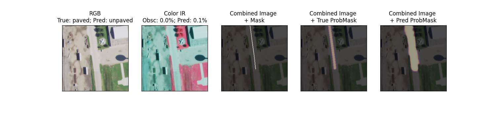
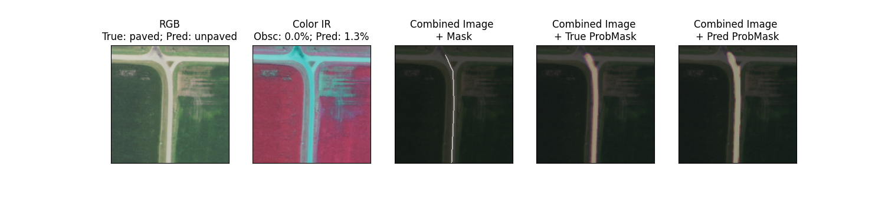
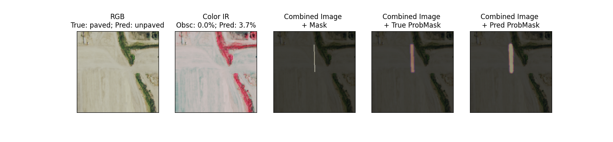
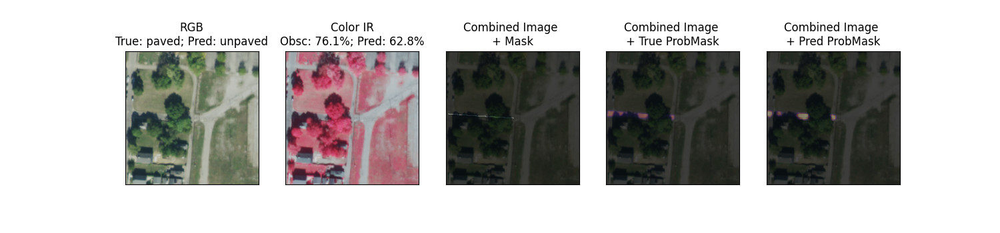
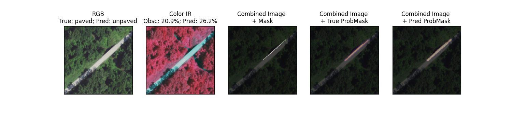
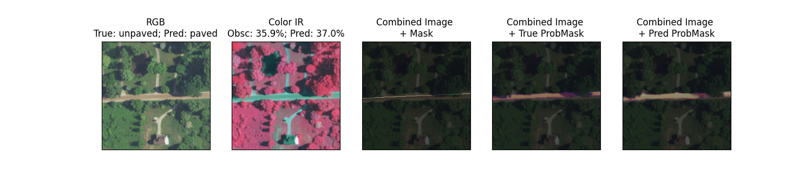
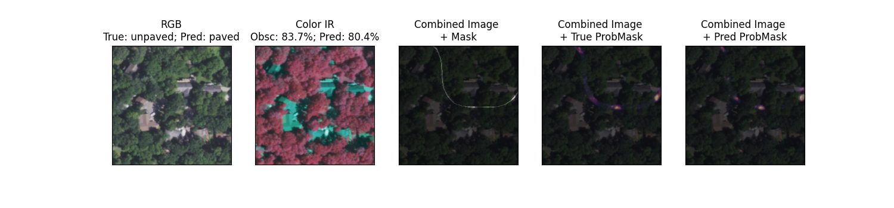
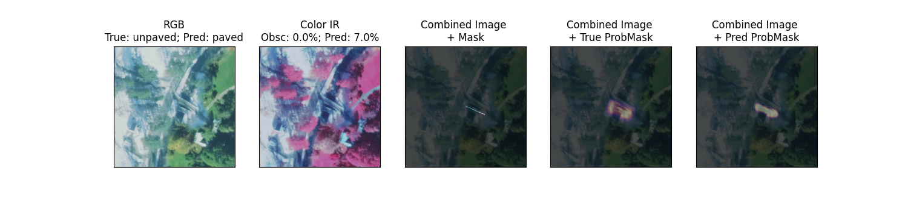
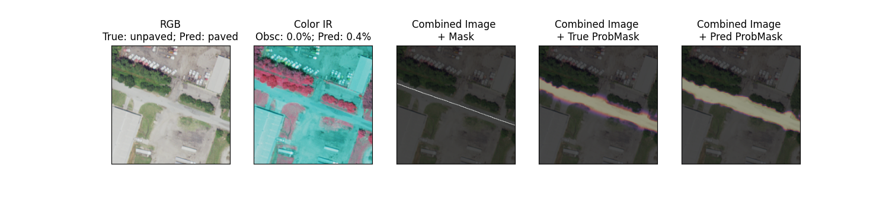
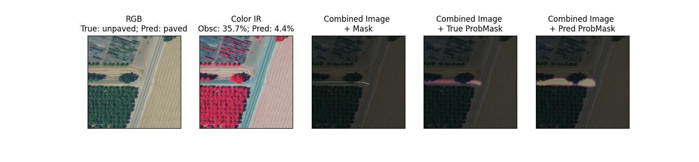
</details>


## Results

**To read the confusion matrix**, for each box, read "when the true label is X, then __% of the time the models predicts Y".

### Paved vs. Unpaved

<figure>
  
  <figcaption>Not bad! The model gets each category right over 95% of the time.</figcaption>
</figure>

### Multiclass
<figure>
  
  <figcaption>Given the imagery resolution, often obscuration of vegetation, and often incorrect truth labels this is impressive. The model clearly shows skill in predicting a wider range of classes than just paved vs. unpaved.</figcaption>
</figure>

<br>

Thanks for getting all the way to the bottom, cheers! :tada:

## Credits

#### MaskCNN Paper
Liu, L. Y. F., Liu, Y., & Zhu, H. (2020). Masked convolutional neural network for supervised learning problems. Stat, 9(1), e290.

## License
[MIT](https://choosealicense.com/licenses/mit/) &copy; 2024 Jonathan Dalrymple